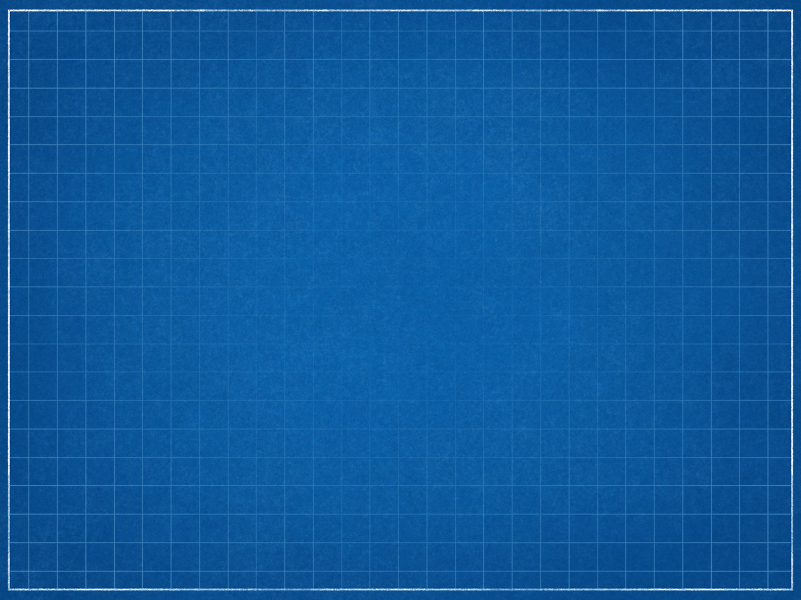

<!-- $theme: gaia -->

Minicurso Linux
===============

Roberto P. Alegro

Semcomp ß

ICMC - USP

---

Linux
=====

O que é Linux?
--------------

Linux é um Kernel Monolítico baseado em UNIX Open Source e Free.

Criado por Linux Trovalds em 1991.

Windows?
--------

Windows é um Sistema Operacional com um kernel próprietário.

---

Linux
=====

Qual o papel de um Kernel?
--------------------------

Um Kernel é o software que faz a interface entre o Sistema Operacional (e programas) e o hardware.

O que é GNU?
------------

GNU é um conjunto de utilidades. Geralmente é pareado com o kernel Linux dando origem ao SO GNU/Linux, muitas vezes chamado só de Linux

---

Linux
=====

O que são distribuições Linux e diferenças?
-------------------------------------------

Um Sistema Operacional GNU/Linux com adição de packages, configurações e geralmente de um package manager.

---

Linux
=====

Outros Linux NON-GNU
--------------------

- Android
- Smart TV
- Embedded
- etc

---

Estutura de diretórios
======================

Sistemas Linux seguem uma estutura de diretórios básica padrão. Com algumas diferenças dependendo da distribuição.

Hierarquia de diretórios

- `/`
Root - A raiz do sistema

- `/home/usuário`
Home - pasta pessoal do usuário (`~`)

---

Estutura de diretórios
======================

- `/root`
Home do usuário `root`

- `/boot`
Imagem do Kernel e bootloader

- `/bin` e `/sbin`
executáveis binários.

- `/usr`
Arquivos relacionados a todos os usuários
	- `/usr/bin`
	- `/usr/share`

---

Estutura de diretórios
======================

- `/tmp`
Arquivos temporários (limpo a cada boot)

- `/proc`
Arquivos que representam processos e sockets

- `/etc` e `/usr/etc`
Arquivos de configuração do sistema

- `/opt`
Arquivos de programas opcionais

- `/srv`
Raramente presente.
Usada para manter um servidor Apache

---

Estutura de diretórios
======================

- `/lib` e `/usr/lib`
Bibliotecas do sistema

- `/dev/`
Representação de devices (mouse, teclado, hd)

- `/var`
Arquivos variáveis (logs, cache, spool)

- `/media` ou `/run`
Ponto de montagem de dispositivos externos

- `/mnt`
Ponto de montagem de uso livre

---

Bash
====

O shell bash (Bourne Again SHell) é a implementação mais popular de um shell POSIX. Apesar de existirem outros (ksh, zsh, csh, fish, etc).

Trabalho do shell
-----------------
- Prover uma 